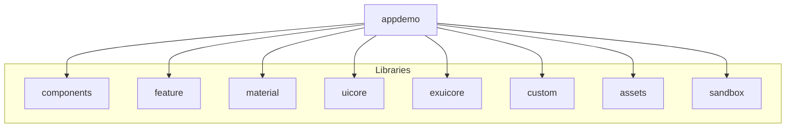

# Nxwork19 - Angular Application

<a alt="Nx logo" href="https://nx.dev" target="_blank" rel="noreferrer"></a>

This is an Angular application built with Nx, a powerful build system with first-class monorepo support and powerful integrations.

## Getting Started

### Prerequisites
- Node.js (v16 or later)
- npm or yarn

### Installation

1. Clone the repository
2. Install dependencies:
```sh
npm install
```

## Development

To start the development server:

```sh
npx nx serve appdemo
```

The application will be available at `http://localhost:4200`

## Running in Electron Mode

To start the application in Electron mode:

```sh
npm run app
```

This will launch the application as a desktop application using Electron.

## Building

To create a production build:

```sh
npx nx build appdemo
```

The build artifacts will be stored in the `dist/` directory.

## Testing

To run unit tests:

```sh
npx nx test appdemo
```

To run end-to-end tests:

```sh
npx nx e2e appdemo-e2e
```

## Project Structure

This workspace contains:

- `appdemo`: The main Angular application
- `appdemo-e2e`: End-to-end tests for the application

## Project Dependencies



## Available Commands

To see all available targets for a project:

```sh
npx nx show project appdemo
```

## Adding New Features

To generate a new component:

```sh
npx nx g @nx/angular:component my-component --project=appdemo
```

To generate a new service:

```sh
npx nx g @nx/angular:service my-service --project=appdemo
```

## Nx Cloud

This workspace is connected to Nx Cloud for enhanced build performance and caching. Features include:

- Remote caching
- Distributed task execution
- Automated test splitting
- Flaky test detection

## Useful Links

- [Nx Documentation](https://nx.dev)
- [Angular Documentation](https://angular.io/docs)
- [Nx Console Extension](https://nx.dev/getting-started/editor-setup)