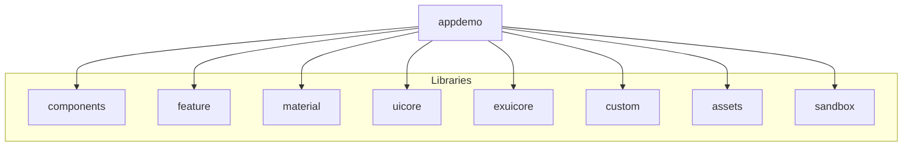

# Application Builder - Angular Application

<a alt="Nx logo" href="https://nx.dev" target="_blank" rel="noreferrer"></a>

## Overview

This is a modern Angular application built with Nx, a powerful build system that provides first-class monorepo support and powerful integrations. The application is designed to be scalable, maintainable, and follows best practices for enterprise-level development.

## Features

- 🚀 Built with Angular and Nx
- 📦 Monorepo architecture
- 🎨 Material Design integration
- 🖥️ Electron support for desktop deployment
- 🧪 Comprehensive testing setup
- 🔄 Nx Cloud integration for enhanced build performance

## Prerequisites

Before you begin, ensure you have the following installed:
- Node.js (v16 or later)
- npm (v7 or later) or yarn (v1.22 or later)
- Git

## Getting Started

### Installation

1. Clone the repository:
```sh
git clone [repository-url]
cd app-builder
```

2. Install dependencies:
```sh
npm install
```

### Development

To start the development server:

```sh
npx nx serve appdemo
```

The application will be available at `http://localhost:4200`

### Running in Electron Mode

To start the application as a desktop application:

```sh
npm run app
```

## Project Structure

The workspace is organized into the following main components:



## Available Commands

### Development
```sh
# Start development server
npx nx serve appdemo

# Start in Electron mode
npm run app

# View all available targets
npx nx show project appdemo
```

### Building
```sh
# Create production build
npx nx build appdemo

# Build for Electron
npm run build:electron
```

### Testing
```sh
# Run unit tests
npx nx test appdemo

# Run end-to-end tests
npx nx e2e appdemo-e2e

# Run tests with coverage
npx nx test appdemo --coverage
```

### Code Generation
```sh
# Generate a new component
npx nx g @nx/angular:component my-component --project=appdemo

# Generate a new service
npx nx g @nx/angular:service my-service --project=appdemo

# Generate a new library
npx nx g @nx/angular:lib my-lib
```

## Nx Cloud Features

This workspace is connected to Nx Cloud, providing:
- 🚀 Remote caching for faster builds
- ⚡ Distributed task execution
- 🧪 Automated test splitting
- 🔍 Flaky test detection
- 📊 Build analytics and insights

## Contributing

1. Create a feature branch (`git checkout -b feature/amazing-feature`)
2. Commit your changes (`git commit -m 'Add amazing feature'`)
3. Push to the branch (`git push origin feature/amazing-feature`)
4. Open a Pull Request

## Useful Links

- [Nx Documentation](https://nx.dev)
- [Angular Documentation](https://angular.io/docs)
- [Nx Console Extension](https://nx.dev/getting-started/editor-setup)
- [Angular Material](https://material.angular.io)
- [Electron Documentation](https://www.electronjs.org/docs)

## License

This project is licensed under the MIT License - see the LICENSE file for details.